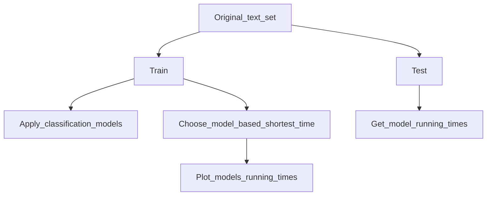

# Targets: how to build pipelines in R

This is a new project to practise and learn how to use Targets package to automate pipelines in R. I will start testing it using text classification models and later on with univariate time series models.

It allows us to practise several skills: 

- Fuunctions building 
- Model creation
- Pipeline management
- Model fitting and upgrading  

At a later stage in development I will combine the output of this pipeline example with a Shiny dashboard

# Using targets on two models

- 1. Text classification model using elastic and XGBOOST models
- 2. Time Series model using ARIMA to predict 7 days AE Type I Attendances

# Testing a small text classification model using Targets 

The aim of this project is to use  Targets package to setup a small text classification model using Tidymodels and Themis packages.

As a way to learn text classifications models, I will follow this video from Andrew Couch:
- **Andrew Couch** *TidyTuesday: Improving Model Train Times with TidyModels*
- https://www.youtube.com/watch?v=MVQExXGooaM&t=187s

## Classification model using parallel processing analysis steps

1. **Load .csv data**
2. **Summarize Dialogue by character**
3. Address class imbalance  
4. Create initial train test split
5. Build matrix to count number of words by character
- 5.1 Apply naive tokenization to our TRAIN and TEST sets 
6. **PRE-PROCESSING**
- 6.1. Tokenization
- 6.2. Remove stop-words
- 6.3. Create a token folder whre max_tokens is (75)
- 6.4. Then we compute the tfidf() algorithm
7. **MODEL FITTING**
- 7.1 Simple model: Elastic net model.
- 7.2 Complex model. XGBOOST MODEL. This is a specific type of TREE model
8. **MODEL PARAMETERS TUNING**
- 8.1 Elastic model parameters tuning
- 8.1.1 elastic grid_regular() set of parameters chosen using dials package  
- 8.1.2 elastic grid_ma_entropy() set of parameters chosen using dials package 
- 8.2 XGBOOST model parameters tuning 
- 8.2.1 XGBOOST grid_regular() set of parameters chosen using dials package  
- 8.2.2 XGBOOST grid_max_entropy() set of parameters chosen using dials package 
9. Compare data structures from both models using a regular gird 

And in the process I will explore new models and test many of the functions he uses to conduct his analysis

I will use some text examples from Harry Potter books to conducting the analysis, based on several variables from its characters and their text quotes in the book. Tidymodels package is the framework chosen to build a small classification model based on this data.
https://www.kaggle.com/datasets/balabaskar/harry-potter-books-corpora-part-1-7

Classifcation models predicting a class label for a given observation

### Dealing with imbalanced data  
-	When dealing with a classification data set with skewed class proportions is called imbalanced data. 
-	Within this data set we find two types of imbalanced data classes:
-	Classes that make the largest proportion of the data are defined as majority classes
-	Classes that make the smaller proportion are called minority classes
-	Classification model using imbalanced data
-	This is a small example on how to use Targets to create and run a classification predictive model where the distribution of examples across the classes is not equal.

We use Themis package in R to deal with imbalanced data
https://github.com/tidymodels/themis

Themis package makes use of the Recipes package
-	With recipes, you can use DPLYR like pipeable sequences of feature engineering steps to get your data ready for modelling.
- Also we make use of the specific library **textrecipes**, it contain extra steps for the recipes package for preprocessing text data.
https://github.com/tidymodels/textrecipes
-	The easiest way to get recipes is to install all of the tidy models packages
https://www.tidymodels.org/packages/

### Training times model comparison

The aim of this small project was to practise how to tune different models using Tidy models framework. At the end we obtain the different training times depending on the model we have used. 

This plot can be useful in future models to quicly assess model performance

## TS Forecasting model using ARIMA model

This second example is a Time Series model using ARIMA to forecast 7 days AE Type I Attendances in England. I will create the model and use Targets to build a pipeline to run it. 

- **TS 01. Start by importing the data and turning it into a TS object**

Using TSstudio library https://ramikrispin.github.io/TSstudio/

library(TSstudio)

ts_plot (AE_major_ts)

- **TS 02. Check for trend seasonallity and other regular patterns**
- Decompose original TS into (Random,Sesonal, Trend, Observed components). Using Additive and multiplicative ts

- **TS 03. Seasonal plot to check for Seasonality by Frequency Unit and Cycle**

